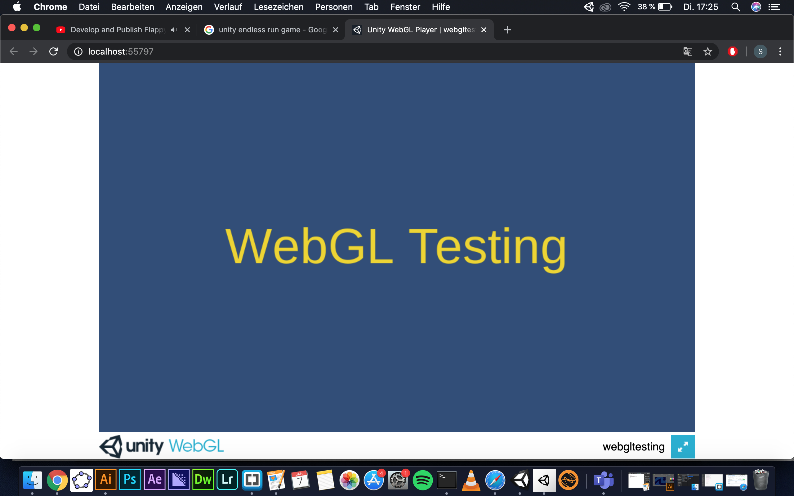

# inclass-webgl-sloos

### Project description: 
2D WebGL testing repository and hosting.

### Development platform: 
Unity version 2019.1.14f1
Visual Studio Community 2017
Mac Os Mojave Version 10.14.6

### Target platform: 
WebGL, reference resolution 960 x 600

### Visuals: 

### Necessary setup/execution steps: 
None

### Third party material: 
None

### Project state: 
100%

### Limitations: 
None

### Lessons Learned: 
* Switch Platform from Standalone to WebGL
* Build WebGL
* GitHub Pages, with docs

---
Copyright by sloos 